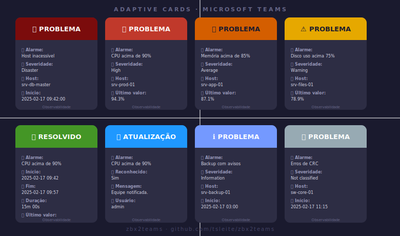

<div align="center">

# 🔔 zbx2teams

### Zabbix → Microsoft Teams com Adaptive Cards

**Alertas visuais com a cor exata de cada severidade do Zabbix Server**

[](LICENSE)
[](https://www.zabbix.com)
[](https://www.gnu.org/software/bash/)
[](https://www.microsoft.com/teams)
[](https://adaptivecards.io)

<br>


<br>

</div>

---

## 📋 Índice

- [Sobre o Projeto](#-sobre-o-projeto)
- [Preview dos Cards](#-preview-dos-cards)
- [Paleta de Cores](#-paleta-de-cores)
- [Pré-requisitos](#-pré-requisitos)
- [Instalação](#-instalação)
- [Configuração no Zabbix](#-configuração-no-zabbix)
- [Configurar Webhook via Workflows no Teams](#-configurar-webhook-via-workflows-no-teams)
- [Menções opcional](#-menções-opcional)
- [Testes](#-testes)
- [Estrutura do Card](#-estrutura-do-card)
- [Troubleshooting](#-troubleshooting)
- [Contribuindo](#-contribuindo)
- [Autor](#-autor)
- [Licença](#-licença)

---

## 🎯 Sobre o Projeto

**zbx2teams** é um script shell que integra o **Zabbix Server** ao **Microsoft Teams**, entregando notificações em **Adaptive Cards v1.5** com identificação visual imediata por severidade.

O diferencial é simples: cada card chega no Teams com a **cor de fundo idêntica à severidade do Zabbix Server** — os mesmos hexadecimais usados na interface web. Em ambientes com múltiplos alertas, a equipe identifica a criticidade antes mesmo de ler o texto.

**Funcionalidades:**

- Cor de banner hex fiel ao Zabbix Server (sem aproximações)
- 3 tipos de card: Problema · Resolvido · Atualização
- Corpo em formato FactSet (lista alinhada título → valor)
- Menções de responsáveis no Teams (opcional — se vazio, não aparece no card)
- Botão direto para o evento no Zabbix (opcional)
- Sem dependências além de `bash` e `curl`
- Retry automático em falhas de rede
- Testado no **Zabbix 7 LTS**
- Suite de testes com `--dry-run`, `--single`, `--verbose`

---

## 🖼 Preview dos Cards



---

## 🎨 Paleta de Cores


| Evento / Severidade | Hex | Cor |
|---|---|---|
| Resolvido | `#449626` | Verde |
| Atualização | `#1F98FF` | Azul |
| Not classified | `#97AAB3` | Cinza |
| Information | `#7499FF` | Azul claro |
| Warning | `#E6A800` | Amarelo forte |
| Average | `#D45E00` | Laranja forte |
| High | `#C0392B` | Vermelho forte |
| Disaster | `#7B0C0C` | Vinho escuro |

> Todos os hexadecimais foram extraídos diretamente do CSS oficial do Zabbix Server.

---

## 📦 Pré-requisitos

| Requisito | Versão |
|---|---|
| Zabbix Server / Proxy | 6.x ou superior (testado no **7 LTS**) |
| bash | 4.x+ |
| curl | qualquer versão recente |
| Microsoft Teams | Canal com **Workflow** configurado (Power Automate) |

---

## 🚀 Instalação

### 1. Clone o repositório

```bash
git clone https://github.com/tsleite/zbx2teams.git
cd zbx2teams
```

### 2. Copie o script para o servidor Zabbix

```bash
# Confirme o diretório configurado no seu servidor:
grep AlertScriptsPath /etc/zabbix/zabbix_server.conf

# Copie, ajuste dono e permissão:
cp zabbix_teams.sh /usr/lib/zabbix/alertscripts/
chown zabbix:zabbix /usr/lib/zabbix/alertscripts/zabbix_teams.sh
chmod 755 /usr/lib/zabbix/alertscripts/zabbix_teams.sh
```

---

## ⚙️ Configuração no Zabbix

### 1. Timeout do servidor

O timeout padrão do Zabbix é **3 segundos** — insuficiente para o handshake TLS + POST ao Teams.

```bash
sudo nano /etc/zabbix/zabbix_server.conf
```

```ini
Timeout=30
```

```bash
sudo systemctl restart zabbix-server
```

---

### 2. Media Type

**Caminho:** `Alerts → Media types → Create media type`

| Campo | Valor |
|---|---|
| Name | `Microsoft Teams` |
| Type | `Script` |
| Script name | `zabbix_teams.sh` |
| Enabled | marcado |

#### Script parameters — ordem obrigatória

> A ordem é crítica. Um parâmetro fora de lugar causa falha silenciosa.

| # | Valor |
|---|---|
| 1 | `{ALERT.SENDTO}` |
| 2 | `{ALERT.SUBJECT}` |
| 3 | `{ALERT.MESSAGE}` |
| 4 | `{$ZABBIX.URL}` |
| 5 | `{TRIGGER.SEVERITY}` |

---

### 3. Message Templates

Aba **Message templates** dentro do Media Type. Crie os 3 tipos:

#### Problem

Subject:
```
PROBLEMA: {TRIGGER.NAME}
```

Message:
```
🔔 Alarme: {TRIGGER.NAME}
🎯 Severidade: {TRIGGER.SEVERITY}
🖥️ Host: {HOST.NAME} ({HOST.IP})
📁 Projeto: {EVENT.TAGS.projeto}
⏰ Início: {EVENT.DATE} {EVENT.TIME}
📊 Último valor: {ITEM.LASTVALUE}
📝 Descrição: {TRIGGER.DESCRIPTION}
```

#### Problem recovery

Subject:
```
RESOLVIDO: {TRIGGER.NAME}
```

Message:
```
🔔 Alarme: {TRIGGER.NAME}
🎯 Severidade: {TRIGGER.SEVERITY}
🖥️ Host: {HOST.NAME} ({HOST.IP})
📁 Projeto: {EVENT.TAGS.projeto}
⏰ Início: {EVENT.DATE} {EVENT.TIME}
✅ Fim: {EVENT.RECOVERY.DATE} {EVENT.RECOVERY.TIME}
⏳ Duração: {EVENT.DURATION}
📊 Último valor: {ITEM.LASTVALUE}
📝 Descrição: {TRIGGER.DESCRIPTION}
```

#### Problem update

Subject:
```
ATUALIZACAO: {TRIGGER.NAME}
```

Message:
```
🔔 Alarme: {TRIGGER.NAME}
🎯 Severidade: {TRIGGER.SEVERITY}
🖥️ Host: {HOST.NAME} ({HOST.IP})
📁 Projeto: {EVENT.TAGS.projeto}
⏰ Evento: {EVENT.DATE} {EVENT.TIME}
✅ Reconhecido: {EVENT.ACK.STATUS}
💬 Mensagem: {EVENT.UPDATE.MESSAGE}
🙋 Usuário Zabbix: {USER.FULLNAME}
```

---

### 4. Usuário e Mídia

**Caminho:** `Users → Users → [usuário] → aba Media → Add`

| Campo | Valor |
|---|---|
| Type | `Microsoft Teams` |
| Send to | URL do Webhook gerado pelo Workflow no Teams |
| When active | `1-7,00:00-24:00` |
| Use if severity | Severidades desejadas |
| Status | `Enabled` |

> O campo **Send to** é passado como `$1` ao script. A URL do webhook gerado pelo Workflow fica aqui, não no script.

---

### 5. Trigger Action

**Caminho:** `Alerts → Actions → Trigger actions → Create action`

| Campo | Valor |
|---|---|
| Name | `zbx2teams` |
| Enabled | marcado |

Configure condições conforme necessidade (ex: `Trigger severity >= Warning`).

Na aba **Operations**, repita para os 3 blocos (Operations / Recovery / Update):

1. Clique **Add**
2. **Send to users** → usuário configurado na etapa anterior
3. **Send only to** → `Microsoft Teams`
4. Confirme com **Add**

---

## 🔗 Configurar Webhook via Workflows no Teams

> O **Incoming Webhook** (conector legado do Office 365) foi descontinuado pela Microsoft.
> O método atual e suportado é via **Workflows** (Power Automate), disponível diretamente no Teams.

### Passos para criar o Workflow

1. Acesse o canal desejado no Teams
2. Clique em `···` ao lado do nome do canal → selecione **Workflows**
3. Na barra de busca, procure por:
   ```
   Post to a channel when a webhook request is received
   ```
4. Selecione o template e clique em **Next**
5. Dê um nome ao workflow (ex: `Zabbix Alerts`) e clique em **Next**
6. Selecione o **Team** e o **Canal** de destino
7. Clique em **Add workflow**
8. Copie a **URL do webhook** gerada (formato `https://prod-XX.westus.logic.azure.com/...`)

Use essa URL no campo **Send to** do usuário no Zabbix.

> A URL é longa e única por workflow — guarde-a com segurança.
> Caso perca a URL, é necessário recriar o workflow.

---

## 👥 Menções (opcional)

Edite a seção 3 do `zabbix_teams.sh`:

```bash
# Preencha NAME e EMAIL para habilitar menção no card.
# Deixe ambos vazios ("") para omitir — nenhum bloco será criado.
MENTION1_NAME="João Silva"
MENTION1_EMAIL="joao.silva@empresa.com"
MENTION2_NAME="Maria Santos"
MENTION2_EMAIL="maria.santos@empresa.com"
MENTION3_NAME=""
MENTION3_EMAIL=""
```

| Configuração | Resultado no card |
|---|---|
| NAME + EMAIL preenchidos | Bloco de responsáveis com menção ativa |
| Apenas um dos dois | Pessoa ignorada |
| Todos vazios | Bloco inteiro removido do card |

> O `EMAIL` deve ser o UPN do usuário no Azure AD (geralmente igual ao e-mail corporativo).

---

## 🧪 Testes

### Suite completa

```bash
chmod +x test_zabbix_teams.sh
./test_zabbix_teams.sh
```

### Modos disponíveis

| Comando | Descrição |
|---|---|
| `./test_zabbix_teams.sh` | Envia os 8 cards interativamente |
| `./test_zabbix_teams.sh --dry-run` | Exibe parâmetros sem enviar |
| `./test_zabbix_teams.sh --single High` | Testa apenas severidade High |
| `./test_zabbix_teams.sh --single Disaster --verbose` | Disaster + log completo |
| `./test_zabbix_teams.sh --help` | Menu de ajuda |

O script retorna **exit 0** se todos os testes passarem ou **exit 1** se houver falha — compatível com pipelines CI/CD.

### Teste pontual direto

```bash
sudo -u zabbix /usr/lib/zabbix/alertscripts/zabbix_teams.sh \
  "https://SEU_WEBHOOK_URL" \
  "PROBLEMA: CPU alta" \
  "🔔 Alarme: CPU acima de 90%
🎯 Severidade: High
🖥️ Host: srv-prod-01 (192.168.1.10)
⏰ Início: $(date '+%Y-%m-%d %H:%M:%S')
📝 Descrição: CPU acima do limite por 5 minutos" \
  "https://seuzabbix.empresa.com" \
  "High"
```

> Use sempre `sudo -u zabbix` para simular o contexto exato do Zabbix Server.

---

## 🃏 Estrutura do Card

```
┌──────────────────────────────────────┐
│      [ COR DA SEVERIDADE — HEX ]     │
│           🔴  PROBLEMA               │  ← Banner colorido
├──────────────────────────────────────┤
│  🔔 Alarme:       CPU acima de 90%   │
│  🎯 Severidade:   High               │  ← FactSet
│  🖥️ Host:         srv-prod-01        │    lista título → valor
│  ⏰ Início:       2025-02-17 10:00   │
│  📝 Descrição:    CPU > 90% por 5min │
├──────────────────────────────────────┤
│  [ 🔗 Abrir no Zabbix ]              │  ← Botão (opcional)
├──────────────────────────────────────┤
│  👨‍💻 @João  •  @Maria               │  ← Menções (opcional)
│                        🕐 17/02/25   │
├──────────────────────────────────────┤
│           Observabilidade            │  ← Rodapé centralizado
└──────────────────────────────────────┘
```

---

## 🔧 Troubleshooting

### Timeout while executing a shell script

```bash
# /etc/zabbix/zabbix_server.conf
Timeout=30
sudo systemctl restart zabbix-server
```

### HTTP Code 400 — Bad Request

O payload JSON está malformado. Causa mais comum: `{ALERT.MESSAGE}` com aspas não escapadas.

Teste isolado:
```bash
sudo -u zabbix bash /usr/lib/zabbix/alertscripts/zabbix_teams.sh \
  "URL" "Assunto" "Linha simples sem aspas" "" "High"
```

### Banner sem cor / fundo branco

Requer **Adaptive Card v1.5** e webhook gerado via **Workflows** (Power Automate) — o conector legado do Office 365 (Incoming Webhook) foi descontinuado pela Microsoft e não suporta Adaptive Cards com banner colorido.

### Menção não notifica o usuário

O `MENTION_EMAIL` deve ser o UPN completo no Azure AD. Aliases e IDs de objeto podem não funcionar dependendo da política do tenant.

### Script OK no teste mas falha via Zabbix

```bash
# Verifique dono e permissão
ls -la /usr/lib/zabbix/alertscripts/zabbix_teams.sh

# Simule o contexto exato
sudo -u zabbix /usr/lib/zabbix/alertscripts/zabbix_teams.sh ...

# Logs do Zabbix
tail -f /var/log/zabbix/zabbix_server.log | grep -i "teams\|alert\|script"
```

---

## 📁 Estrutura do Repositório

```
zbx2teams/
├── zabbix_teams.sh          # Script principal
├── test_zabbix_teams.sh     # Suite de testes
├── assets/
│   ├── cards_real_teams.gif # Demonstração real dos cards no Teams
│   ├── cards-preview.svg    # Preview estático de todas as severidades
│   └── severity-colors.svg  # Paleta de cores
└── README.md
```

---

## 🤝 Contribuindo

Pull Requests são bem-vindos! Se você usa Zabbix em produção e encontrou um problema ou quer sugerir melhorias:

1. Fork o repositório
2. Crie sua branch: `git checkout -b minha-feature`
3. Commit: `git commit -m 'feat: adiciona suporte a X'`
4. Push: `git push origin minha-feature`
5. Abra um Pull Request

Relatos de compatibilidade com outras versões do Zabbix ou variações de tenant no Teams são especialmente valiosos para a comunidade.

---

## 👤 Autor

**Tiago Silva Leite**
- Email: [tsl26@pm.me](mailto:tsl26@pm.me)
- GitHub: [github.com/tsleite](https://github.com/tsleite)

Versão atual: **7.0** — Criado em: 2025-02-17 — Testado em: **Zabbix 7 LTS**

---

## 📄 Licença

MIT License — use, modifique e distribua livremente, mantendo os créditos.

---

<div align="center">

Se este projeto te ajudou, considera dar uma ⭐ — isso ajuda outros profissionais de monitoramento a encontrar a solução!

**[⭐ Star no GitHub](https://github.com/tsleite/zbx2teams)**

</div>
